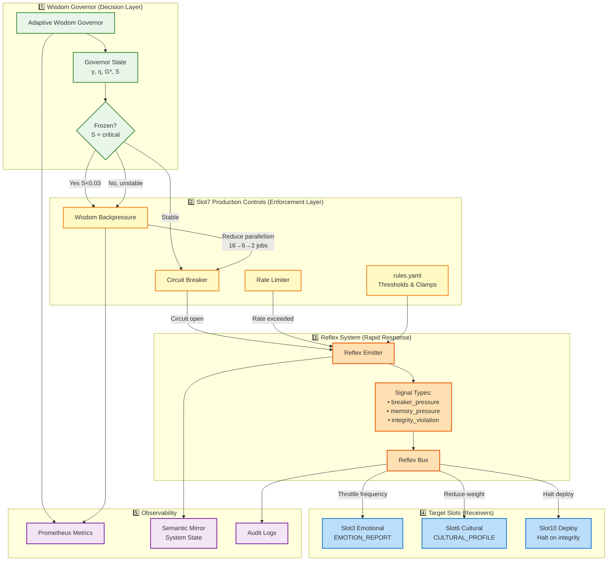

# Nova Ethics Enforcement — How It Actually Works

**Status**: Phase 16-2 Active System
**Last Updated**: 2025-11-13

---

## Overview

Ethics in Nova are **actively enforced** through a multi-layer system:
1. **Wisdom Governor** (ethical decision-making brain)
2. **Slot7 Production Controls** (enforcement mechanism)
3. **Reflex Signals** (rapid response system)
4. **Backpressure** (resource throttling)
5. **Semantic Mirror** (system-wide coordination)

---

## Enforcement Flow Diagram



---

## Layer-by-Layer Breakdown

### 1️⃣ **Wisdom Governor (Ethical Brain)**

**Location**: `orchestrator/adaptive_wisdom_poller.py`, `src/nova/governor/`

**Role**: Makes ethical decisions based on system stability

**How It Works**:
```python
# Compute system state every 15 seconds
γ = (1-η)·γ_t + η·δ           # Wisdom level
G* = C·ρ·S - α·H + N          # Generativity (with novelty from peers)
S = compute_stability_margin() # Distance from Hopf bifurcation

# Ethical decision: Is system safe?
if S < 0.03:  # CRITICAL - bifurcation risk
    set_frozen(True)  # FREEZE LEARNING
    reduce_parallelism_to_minimum()
elif S < 0.10:  # UNSTABLE
    reduce_parallelism()
else:  # STABLE
    normal_operations()
```

**Output**:
- `frozen=True/False` → Global state
- `S` (stability margin) → Backpressure input
- Published to Semantic Mirror → All slots see it

---

### 2️⃣ **Slot7 Production Controls (Enforcement Mechanism)**

**Location**: `src/nova/slots/slot07_production_controls/`

#### **A. Wisdom Backpressure** (`wisdom_backpressure.py`)

**Enforces** reduced parallelism when system unstable:

```python
def compute_max_concurrent_jobs(stability_margin: float) -> int:
    baseline = 16  # Normal capacity
    reduced = 6    # Unstable capacity (37%)
    frozen = 2     # Critical capacity (12%)

    if governor_state.is_frozen():
        return frozen  # SURVIVAL MODE
    elif stability_margin < 0.03:
        return reduced  # REDUCED THROUGHPUT
    else:
        return baseline  # NORMAL
```

**Effect**: System can process fewer requests → prevents cascading failures

**Metrics**:
- `nova_slot07_jobs_current` - Current job cap
- `nova_slot07_jobs_reason` - Why throttled (0=baseline, 1=stability, 2=frozen)

#### **B. Circuit Breaker** (`production_control_engine.py`)

**Enforces** failure protection:

```python
@contextmanager
def protect(self):
    if self.state == "open":
        raise CircuitBreakerOpenError("Circuit breaker is open")

    try:
        yield  # Execute protected operation
    except Exception as exc:
        self._record_failure(exc)
        if self.failure_count >= self.failure_threshold:
            self._state = "open"  # STOP ALL TRAFFIC
            emit_reflex_signal("breaker_pressure", pressure=1.0)
        raise
```

**States**:
- `closed` - Normal (green)
- `half-open` - Testing recovery (yellow)
- `open` - Failed, blocking traffic (red)

**Effect**: Automatically stops traffic to failing slots

---

### 3️⃣ **Reflex System (Rapid Response)**

**Location**: `orchestrator/reflex_signals.py`, `slot07/reflex_emitter.py`

**Enforces** immediate system-wide adjustments:

#### **Signal Types** (from `rules.yaml`):

1. **`breaker_pressure`** - Circuit breaker under strain
   ```yaml
   thresholds:
     high_pressure: 0.8    # Emit at 80% pressure
   clamps:
     min_frequency_multiplier: 0.3  # Reduce Slot3→Slot6 traffic to 30%
     min_weight_multiplier: 0.5     # Reduce synthesis weight to 50%
   ```

2. **`memory_pressure`** - Resource exhaustion
   ```yaml
   thresholds:
     high_pressure: 0.85
   clamps:
     min_frequency_multiplier: 0.2  # Drop to 20% capacity
   ```

3. **`integrity_violation`** - Security/ethical breach
   ```yaml
   thresholds:
     critical_severity: 0.95
   clamps:
     min_frequency_multiplier: 0.1   # Near-halt
     max_weight_multiplier: 2.0      # Boost security signals
   downstream_slots:
     - slot10_civilizational_deployment  # HALT DEPLOYMENTS
   ```

#### **How Reflexes Work**:

```python
# Slot7 detects high pressure
if circuit_breaker.state == "open":
    reflex_emitter.emit(
        signal_type="breaker_pressure",
        pressure_level=0.95,
        clamps={
            "min_frequency": 0.3,  # Throttle to 30%
            "min_weight": 0.5
        }
    )

# Reflex Bus applies to adaptive links
reflex_bus.emit_reflex(signal)
# → Slot3 EMOTION_REPORT frequency: 1.0 → 0.3
# → Slot6 synthesis weight: 1.0 → 0.5
```

**Effect**: Upstream slots throttle automatically, giving downstream slots time to recover

---

### 4️⃣ **Integration with Slots**

**Affected Slots** (from `rules.yaml:146`):

| Slot | Reflex Effect | Purpose |
|------|---------------|---------|
| **Slot01** Truth Anchor | `memory_pressure` → reduce verification frequency | Save compute during pressure |
| **Slot03** Emotional Matrix | `breaker_pressure` → reduce analysis rate | Prevent overwhelming Slot6 |
| **Slot06** Cultural Synthesis | All signals → modulate synthesis | Primary pressure target |
| **Slot10** Deploy | `integrity_violation` → **HALT DEPLOYMENTS** | Ethical emergency brake |

**Contracts Affected**:
- `EMOTION_REPORT@1` - Primary breaker target
- `TRI_REPORT@1` - Memory pressure target
- `CULTURAL_PROFILE@1` - All signal types

---

### 5️⃣ **Observability (Verification)**

**How do you know ethics are enforced?**

#### **Prometheus Metrics**:
```promql
# Wisdom governor state
nova_wisdom_gamma            # Wisdom level (should be stable)
nova_wisdom_frozen           # 1 = learning frozen (critical)
nova_wisdom_generativity     # G* (should stay in bounds)

# Slot7 enforcement
nova_slot07_jobs_current     # Current parallelism cap
nova_slot07_jobs_reason      # Why throttled
nova_slot07_breaker_state    # Circuit breaker state
nova_slot07_breaker_trips_total  # How often breaker opened

# Reflex effectiveness
nova_slot07_reflex_emitted_total{signal_type="breaker_pressure"}
adaptive_link_frequency{contract="EMOTION_REPORT@1"}  # Should drop during pressure
```

#### **Semantic Mirror Keys** (system-wide state):
```python
# Slot7 publishes these keys (all slots can read):
slot07.breaker_state         # "closed", "half-open", "open"
slot07.pressure_level        # 0.0-1.0
slot07.backpressure          # Current throttle state

# Wisdom governor publishes:
wisdom.gamma                 # Current wisdom
wisdom.frozen                # Boolean frozen state
wisdom.stability_margin      # S value
```

#### **Audit Logs**:
```json
{
  "timestamp": "2025-11-13T15:30:00Z",
  "event": "reflex_emitted",
  "signal_type": "integrity_violation",
  "pressure": 0.98,
  "cause": "Slot8 IDS detected anomaly",
  "downstream_effect": "Slot10 deployments halted",
  "trace_id": "ab3c-4d5e"
}
```

---

## Real-World Example: Ethical Enforcement in Action

**Scenario**: Slot6 (Cultural Synthesis) starts producing outputs faster than Slot8 can verify integrity.

### **Automatic Response Chain** (< 1 second):

1. **Detection** (Slot8 IDS):
   ```
   t=0ms: Slot8 detects integrity anomaly
   → Reports to Slot7 Production Controls
   ```

2. **Governor Decision** (Wisdom Governor):
   ```
   t=15ms: Stability margin S drops to 0.025 (below 0.03)
   → set_frozen(True)  # FREEZE LEARNING
   → Published to Semantic Mirror
   ```

3. **Enforcement** (Slot7):
   ```
   t=20ms: wisdom_backpressure.py reads frozen=True
   → max_jobs: 16 → 2 (SURVIVAL MODE)

   t=25ms: Circuit breaker opens (failures > threshold)
   → reflex_emitter.emit("integrity_violation", severity=0.98)
   ```

4. **Propagation** (Reflex Bus):
   ```
   t=30ms: Reflex bus applies clamps:
   → Slot3→Slot6 EMOTION_REPORT frequency: 1.0 → 0.1 (90% reduction)
   → Slot6 synthesis weight: 1.0 → 0.1
   → Slot10 deployments: HALTED
   ```

5. **Observability**:
   ```
   t=50ms: Prometheus metrics updated
   t=60ms: Alert fired: "Wisdom governor frozen, integrity breach"
   t=100ms: Operator notified
   ```

6. **Recovery** (Automatic):
   ```
   t=30s: Slot8 verifies last 100 outputs clean
   → Stability margin recovers: S = 0.08
   → frozen=False
   → Circuit breaker → half-open

   t=45s: Test requests succeed
   → Circuit breaker → closed
   → Jobs: 2 → 6 → 16 (gradual recovery)
   → Reflex clamps release
   ```

**Total downtime**: ~30 seconds autonomous protection
**Prevented**: Cultural synthesis outputs with unverified integrity
**Ethical guarantee**: No untrusted output reached deployment

---

## Configuration & Safety

### **Environment Variables** (Ethical Constraints):

```bash
# Wisdom Governor
NOVA_WISDOM_GOVERNOR_ENABLED=1      # Master switch
NOVA_WISDOM_G_KAPPA=0.03            # Learning rate sensitivity
NOVA_WISDOM_G0=0.60                 # Target generativity

# Slot7 Backpressure
NOVA_SLOT07_MAX_JOBS_BASELINE=16    # Normal capacity
NOVA_SLOT07_MAX_JOBS_REDUCED=6      # Unstable capacity
NOVA_SLOT07_MAX_JOBS_FROZEN=2       # Critical capacity
NOVA_SLOT07_STABILITY_THRESHOLD=0.03  # S threshold

# Reflex System
NOVA_REFLEX_ENABLED=0               # Master reflex switch (default OFF)
NOVA_REFLEX_SHADOW=1                # Compute but don't act (safe default)
```

### **Safety Defaults**:
- Reflex system: **OFF** by default (`enabled: false`)
- Shadow mode: **ON** by default (compute but don't act)
- Circuit breaker: Conservative thresholds
- Backpressure: Gradual reduction (16→6→2, not instant 0)

### **Rollback**:
```bash
# Disable all ethical enforcement (emergency only)
export NOVA_WISDOM_GOVERNOR_ENABLED=0
export NOVA_REFLEX_ENABLED=0

# System reverts to: No throttling, no reflexes, manual only
```

---

## Architecture Philosophy

**Why This Design?**

1. **Multi-Layer Defense**:
   - Governor = Strategic (15s cycles)
   - Circuit Breaker = Tactical (<1s)
   - Reflexes = Reflex (<100ms)

2. **Observable by Default**:
   - Every decision → Prometheus metric
   - Every state change → Semantic Mirror
   - Every reflex → Audit log

3. **Reversible**:
   - Feature flags for all layers
   - Shadow mode for testing
   - Automatic recovery

4. **Provenance**:
   - `trace_id` on all reflexes
   - Audit logs immutable
   - Metrics retained

**Nova Doctrine**: *Ethics enforced through code, not policy documents.*

---

## Verification Commands

```bash
# Check if wisdom governor is active
curl localhost:8000/metrics | grep nova_wisdom_frozen

# Check current job cap (should be <16 if throttled)
curl localhost:8000/metrics | grep nova_slot07_jobs_current

# Check circuit breaker state
curl localhost:8000/metrics | grep nova_slot07_breaker_state

# Check semantic mirror state
curl localhost:8000/health | jq '.semantic_mirror_keys | .["slot07.breaker_state"]'

# View audit log
tail -f ops/logs/reflex_audit_*.jsonl
```

---

## Summary

**Ethics Enforcement in Nova = 3-Layer Active System**:

| Layer | Mechanism | Speed | Effect |
|-------|-----------|-------|--------|
| **Strategic** | Wisdom Governor | 15s | Freeze learning when unstable |
| **Tactical** | Circuit Breaker + Backpressure | <1s | Reduce throughput 16→2 jobs |
| **Reflex** | Reflex Signals | <100ms | Throttle upstream, halt deploy |

**Key Point**: Ethics are **actively enforced in real-time**, not "guidelines."

When system becomes unstable or detects integrity issues:
1. Learning **freezes** (η → 0)
2. Throughput **throttles** (16 → 2 jobs)
3. Upstream slots **back off** (frequency → 30%)
4. Deployments **halt** (integrity violation)

**All automatic. All observable. All reversible.**

---

**Generated**: 2025-11-13
**Version**: Phase 16-2 (Wisdom Governor + Federation Active)
