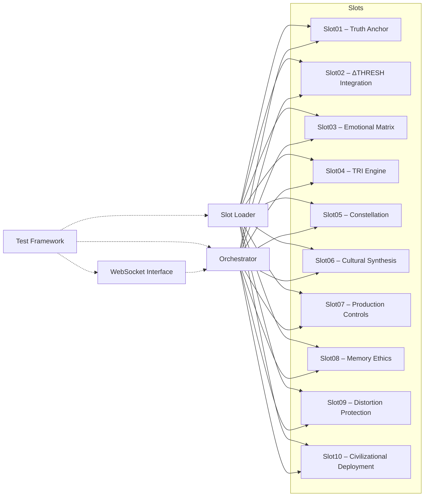
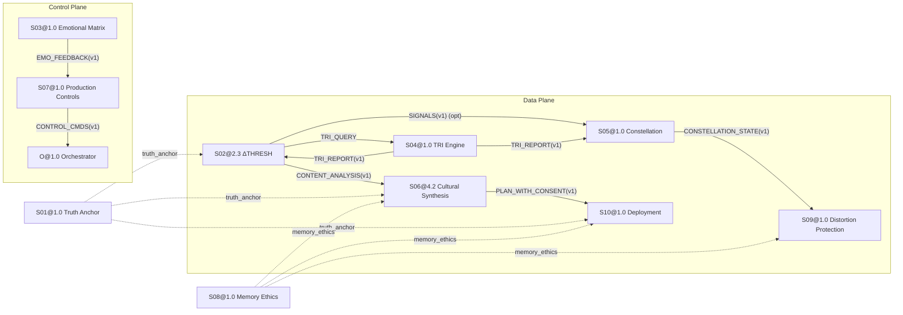

# NOVA Architecture

NOVA's civilizational system centers on an **Orchestrator** and **Slot Loader** that coordinate ten specialized slots. External interfaces like the test framework and WebSocket adapter feed requests into the orchestrator, while each slot contributes focused capabilities such as truth anchoring, cultural synthesis, and distortion protection.

### Evolvable system map

The following map is generated from [`system_map.yaml`](system_map.yaml) in CI and
uses contract IDs that link to machine-readable definitions under
[`docs/contracts/`](contracts/).

## Slot summaries
- **Slot 1 – Truth Anchor:** core reality lock with recovery protocols.
- **Slot 2 – ΔTHRESH Integration Manager:** threshold detection and pattern analysis pipeline.
- **Slot 3 – Emotional Matrix Safety:** distributed emotional computation with safety bounds.
- **Slot 4 – TRI Engine:** advanced truth measurement with Kalman/Bayesian components.
- **Slot 5 – Constellation Navigation:** phase-space navigation anchored for failover.
- **Slot 6 – Cultural Synthesis:** multicultural adaptation engine with formal contract.
- **Slot 7 – Production Controls:** system orchestration and cross-slot coordination.
- **Slot 8 – Memory Ethics & Protection:** immutable memory safeguards and ethical boundaries.
- **Slot 9 – Distortion Protection:** infrastructure-aware detection and defense.
- **Slot 10 – Civilizational Deployment:** deployment layer wrapping Slot 6 guardrails.

## Slot maturity
| Slot | Name                         | Score | Level      |
| ---: | ---------------------------- | ----: | ---------- |
| 1    | Truth Anchor                 | 4     | Processual |
| 2    | ΔTHRESH Integration Manager  | 4     | Processual |
| 3    | Emotional Matrix Safety      | 2     | Relational |
| 4    | TRI Engine                   | 3     | Structural |
| 5    | Constellation Navigation     | 2     | Relational |
| 6    | Adaptive Synthesis Engine    | 4     | Processual |
| 7    | Production Controls          | 2     | Relational |
| 8    | Memory Lock & IDS Protection | 3     | Structural |
| 9    | Distortion Protection        | 4     | Processual |
| 10   | Deployment & Modeling        | 3     | Structural |

## How data flows
- Test Framework or WebSocket sends a request.
- Slot Loader initializes and loads all slots.
- Orchestrator routes the request to relevant slots.
- Slots process data and return results to the orchestrator.
- Orchestrator composes the final response.

## Legend
- `-->` solid arrow: contract-bound data flow.
- `-.->` dashed arrow: labeled constraint or external interaction.
- `(opt)` denotes an optional flow; `⚗️` marks experimental paths.
- Edge labels like `TRI_REPORT(v1)` map to files in `docs/contracts/`.
- Rectangles: functional components or slots.
