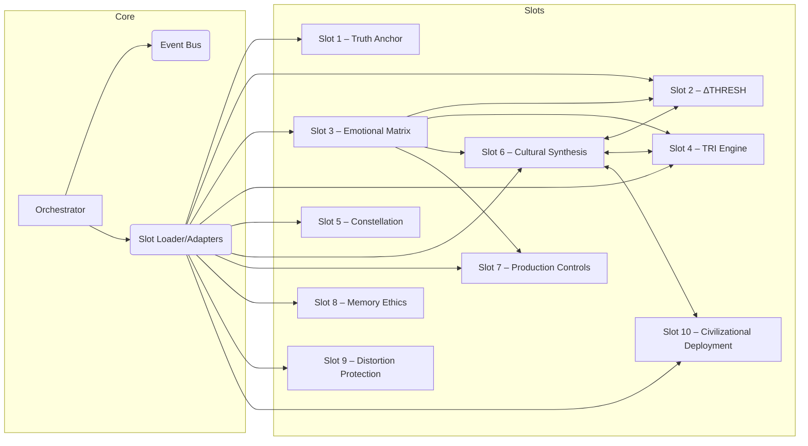

## High-Level Overview
NOVA employs a 10-slot modular model coordinated by an Orchestrator. Slots expose adapters through a Plugin Loader/Registry, communicate via an in-process Event Bus, and surface health signals through per-slot `/health` endpoints.



```mermaid
flowchart LR
    subgraph Orchestrator
        P[PluginLoader] --> R[AdapterRegistry]
        R -->|call()| Providers[(Slot Adapters)]
        R -->|null| NullAdapters[(Null Adapters)]
    end

    subgraph Contracts
        EM[EMOTION_REPORT@1]
        DT[DELTA_THREAT@1]
        TRI[TRI_REPORT@1]
        PC[PRODUCTION_CONTROL@1]
        CP[CULTURAL_PROFILE@1]
    end

    Providers --> EM & DT & TRI & PC & CP
    NullAdapters --> EM & DT & TRI & PC & CP
```

### Slot Summaries
| Slot | Purpose | Key Modules | Health Endpoint |
|------|---------|-------------|-----------------|
|1 Truth Anchor|Cryptographic reality lock & recovery|`truth_anchor_engine.py`, `enhanced_truth_anchor_engine.py`|`slots/slot01_truth_anchor/health.py`|
|2 ΔTHRESH|Pattern detection & manipulation mitigation|`core.py`, `models.py`, `patterns.py`|Plugin `health()`|
|3 Emotional Matrix|Emotional analysis with escalation & advanced safety|`emotional_matrix_engine.py`, `escalation.py`, `advanced_policy.py`|`health/__init__.py`|
|4 TRI Engine|Truth Resonance Index calculation|`engine.py`, `ids_integration.py`|Plugin `health()`|
|5 Constellation|Navigation & stability index|`constellation_engine.py`, `health.py`|`health.py`|
|6 Cultural Synthesis|Cultural profile synthesis (legacy+new engines)|`engine.py`, `multicultural_truth_synthesis.py`, `adapter.py`|Plugin `health()`|
|7 Production Controls|Rate limit, circuit breaker, resource protection|`production_control_engine.py`, `health.py`|`health.py`|
|8 Memory Ethics|IDS protection & lock guard|`ids_protection.py`, `lock_guard.py`|None (adapter metrics only)|
|9 Distortion Protection|Hybrid IDS policy & audit|`hybrid_api.py`, `ids_policy.py`|None|
|10 Civilizational Deployment|Deployment flow, MLS, models|`deployer.py`, `phase_space.py`, `mls.py`|None|

### Inter-slot Contracts
| Producer → Consumer | Contract | Payload Keys | Failure/Fallback |
|---------------------|----------|--------------|-----------------|
|Slot3 → Orchestrator/Slots|EMOTION_REPORT@1|`emotional_tone`, `score`, `confidence`, `safety`|NullAdapter returns neutral report|
|Slot3 → Slot2|DELTA_THREAT@1|`threat_level`, `confidence`, `content_hash`|NullAdapter returns `{error: "no_provider_for_contract: DELTA_THREAT@1"}`|
|Slot4 → Slot3|TRI_REPORT@1|`tri_score`, `variance`, `source_slot`|NullAdapter provides baseline TRI report|
|Slot3 → Slot7|PRODUCTION_CONTROL@1|`action`, `rate_limited`, `reason_codes`|Fallback triggers local circuit breaker|
|Slot6 → Orchestrator/Slots|CULTURAL_PROFILE@1|`culture_id`, `principle_preservation_score`, `residual_risk`|NullAdapter supplies default profile|

### Feature Flags
| Flag | Default | Effect | Risk |
|------|--------|--------|------|
|SLOT3_ESCALATION_ENABLED|True|Enable Slot‑3 escalation manager|False alarms if mis-tuned|
|SLOT3_RATE_PER_MIN|600|Escalation rate limiter|Throttling legitimate alerts|
|SLOT3_SWING_WINDOW|30|Swing detection window|Too small → noise; too big → delay|
|SLOT3_SWING_DELTA|1.2|Swing threshold|Mis-sized sensitivity|
|SLOT3_PREVIEW_MAXLEN|160|Escalation preview truncation|Information loss on context|
|PRODUCTION_CONTROLS_ENABLED|True|Activate Slot‑7 controls|Over-blocking if misconfigured|
|RATE_LIMIT_ENABLED|True|Global request limiter|DoS risk if disabled|
|RESOURCE_PROTECTION_ENABLED|True|Payload/time/concurrency caps|Exhaustion if disabled|
|HEALTH_CHECK_ENABLED|True|Expose `/health` endpoints|Undetected failures if off|

### Operational Health
* `/health` aggregates slot metrics, router thresholds, circuit breaker status, and slot self-checks (`collect_slot_selfchecks`).
* `/health/config` returns hot-reload flag, slot list, and environment configuration.
* Slot 3 health adds `escalation_status`, `safety_policy_status`, `enhanced_engine_status`, and `sample_analysis` as defined in [`contracts/slot3_health_schema.json`](../contracts/slot3_health_schema.json).
