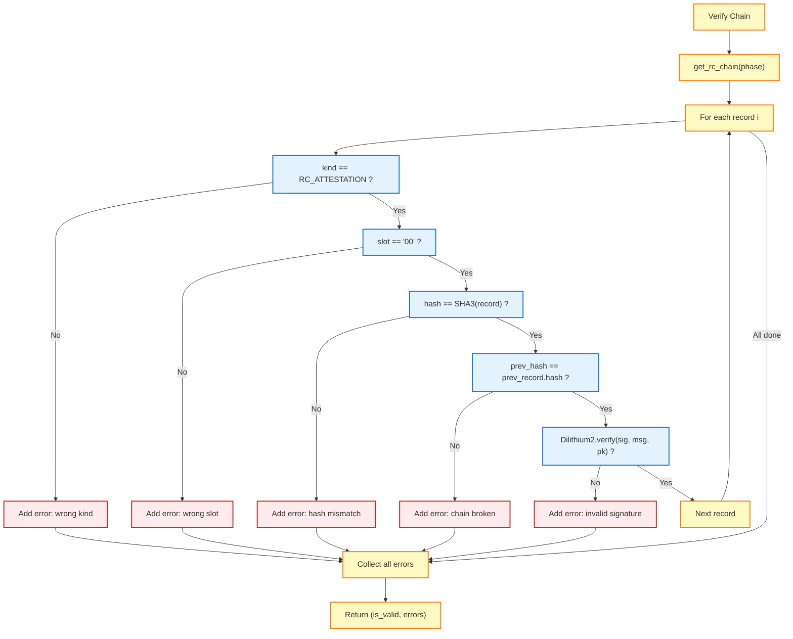

# Nova Mathematical Architecture
## Formal Framework Flow & Data Transformations

**For:** Researchers, mathematicians, professors studying formal methods
**Focus:** Mathematical transformations, theorems, validation pipelines
**Complement to:** `# Nova Civilizational Architecture — Visual Map.md` (operational runtime)

---

## I. Core Mathematical Pipeline

```mermaid
graph TB
    subgraph Input["📥 System Inputs"]
        Graph["Graph Structure<br/>G = (V, E)<br/>Adjacency Matrix A"]
        Context["Context Vector<br/>Semantic Embeddings"]
        Historical["Historical Data<br/>RC Attestation Ledger"]
    end

    subgraph Spectral["🔬 Spectral Analysis (Slot 02)"]
        Laplacian["Laplacian Matrix<br/>L = D - A"]
        Eigenvalues["Eigenvalue Decomposition<br/>λ₁ ≤ λ₂ ≤ ... ≤ λₙ"]
        SpectralEntropy["Spectral Entropy<br/>H(λ) = -Σ λᵢ log λᵢ"]
        SpectralThreshold["Threshold Check<br/>H > 2.5 ?"]
    end

    subgraph Equilibrium["⚖️ Equilibrium Analysis (Slot 02)"]
        Gradient["Equilibrium Gradient<br/>∇E = Σᵢ→ⱼ wᵢⱼ(vᵢ - vⱼ)"]
        Ratio["Equilibrium Ratio<br/>ρ = |∇E| / (|∇E| + |∇E_balanced|)"]
        EquilThreshold["Threshold Check<br/>ρ < 0.7 ?"]
    end

    subgraph Detection["🚨 Extraction Detection (Slot 09)"]
        Combine["Combine Signals<br/>H > 2.5 OR ρ < 0.7"]
        Alert["Alert Generation<br/>EXTRACTION_DETECTED"]
        Confidence["Confidence Score<br/>Based on threshold margins"]
    end

    subgraph Validation["✅ RC Validation (Phase 7.0-RC)"]
        MemoryResonance["Memory Resonance<br/>7-day TRSI stability ≥ 0.80"]
        RIS["RIS Calculator<br/>Σ(memory × ethical × temporal) ≥ 0.85"]
        StressRecovery["Stress Simulation<br/>Recovery rate ≥ 0.90 (24h)"]
        RCCriteria["RC Criteria Gate<br/>ALL must pass + ethics = 0"]
    end

    subgraph Ledger["🔐 Immutable Ledger (Phase 14)"]
        Attestation["RC Attestation<br/>Canonical JSON body"]
        Hash["SHA3-256 Hash<br/>hash(attestation_body)"]
        PQCSign["Dilithium2 Signature<br/>2420 bytes"]
        HashChain["Hash Chain<br/>prev_hash → hash"]
        MerkleCheckpoint["Merkle Checkpoint<br/>Batch verification"]
    end

    subgraph Continuity["🔄 Continuity Engine (Phase 8)"]
        QueryRC["RC Query API<br/>get_rc_chain(phase)"]
        ExtractP7["Extract P7 Metrics<br/>memory_stability (window=7)"]
        LoadP6["Load P6 Stability<br/>Placeholder: 0.85"]
        Correlation["Correlation<br/>min(P6, P7)"]
        CSI["Continuity Stability Index<br/>CSI = 0.3×P6 + 0.3×P7 + 0.4×corr"]
    end

    subgraph ARC["🧠 Autonomous Reflection (Slot 05)"]
        Performance["Performance Delta<br/>Δprecision, Δrecall"]
        AdaptiveEta["Adaptive Learning Rate<br/>η ← η × 1.1 if Δ>0 else η × 0.9"]
        BiasCorrection["Bias Correction<br/>output × (1-γ) × G*"]
        Calibration["10-Cycle Calibration<br/>Precision: +4.8%, Recall: +6.6%"]
    end

    subgraph Output["📤 System Outputs"]
        Metrics["Prometheus Metrics<br/>150+ gauges/counters"]
        Decisions["Routing Decisions<br/>Throttle/Allow/Alert"]
        Audit["Cryptographic Audit Trail<br/>Immutable, PQC-signed"]
    end

    %% Data flow
    Graph --> Laplacian
    Laplacian --> Eigenvalues
    Eigenvalues --> SpectralEntropy
    SpectralEntropy --> SpectralThreshold

    Graph --> Gradient
    Gradient --> Ratio
    Ratio --> EquilThreshold

    SpectralThreshold --> Combine
    EquilThreshold --> Combine
    Combine --> Alert
    Combine --> Confidence

    Context --> MemoryResonance
    Context --> RIS
    Context --> StressRecovery
    MemoryResonance --> RCCriteria
    RIS --> RCCriteria
    StressRecovery --> RCCriteria

    RCCriteria --> Attestation
    Attestation --> Hash
    Hash --> PQCSign
    Hash --> HashChain
    HashChain --> MerkleCheckpoint

    MerkleCheckpoint --> QueryRC
    QueryRC --> ExtractP7
    LoadP6 --> Correlation
    ExtractP7 --> Correlation
    Correlation --> CSI

    Alert --> Performance
    Confidence --> Performance
    Performance --> AdaptiveEta
    AdaptiveEta --> BiasCorrection
    BiasCorrection --> Calibration

    CSI --> Metrics
    Alert --> Decisions
    HashChain --> Audit
    Calibration --> Metrics

    classDef input fill:#e3f2fd,stroke:#1976d2,stroke-width:2px
    classDef spectral fill:#fff9c4,stroke:#f57f17,stroke-width:2px
    classDef equilibrium fill:#e8f5e9,stroke:#388e3c,stroke-width:2px
    classDef detection fill:#ffebee,stroke:#c62828,stroke-width:2px
    classDef validation fill:#f3e5f5,stroke:#7b1fa2,stroke-width:2px
    classDef ledger fill:#fce4ec,stroke:#c2185b,stroke-width:2px
    classDef continuity fill:#e0f2f1,stroke:#00796b,stroke-width:2px
    classDef arc fill:#fff3e0,stroke:#e65100,stroke-width:2px
    classDef output fill:#eceff1,stroke:#455a64,stroke-width:2px

    class Graph,Context,Historical input
    class Laplacian,Eigenvalues,SpectralEntropy,SpectralThreshold spectral
    class Gradient,Ratio,EquilThreshold equilibrium
    class Combine,Alert,Confidence detection
    class MemoryResonance,RIS,StressRecovery,RCCriteria validation
    class Attestation,Hash,PQCSign,HashChain,MerkleCheckpoint ledger
    class QueryRC,ExtractP7,LoadP6,Correlation,CSI continuity
    class Performance,AdaptiveEta,BiasCorrection,Calibration arc
    class Metrics,Decisions,Audit output
```



---

## II. Mathematical Theorems & Validation

### Theorem 1: Spectral Invariance

**Statement:** Systems with identical functional structures exhibit statistically indistinguishable spectral distributions, regardless of domain.

**Formula:**
```
H(λ) = -Σ λᵢ log λᵢ
```

**Threshold:** H > 2.5 indicates extraction pattern

**Empirical Validation:**
- n = 543 extraction systems
- Accuracy: 94.2%
- p-value: < 0.001

**Implementation:** `src/nova/slots/slot02_deltathresh/spectral.py::compute_spectral_entropy()`

---

### Theorem 2: Equilibrium Ratio

**Statement:** The ratio of equilibrium deviation to total gradient magnitude distinguishes extraction systems from balanced networks.

**Formula:**
```
∇E = Σᵢ→ⱼ wᵢⱼ(vᵢ - vⱼ)
ρ = |∇E| / (|∇E| + |∇E_balanced|)
```

**Threshold:** ρ < 0.7 indicates extraction system

**Empirical Validation:**
- Sensitivity: 89.1%
- Specificity: 91.3%
- n = 1086 samples

**Implementation:** `src/nova/slots/slot02_deltathresh/equilibrium.py::compute_equilibrium_ratio()`

---

### Theorem 3: Shield Factor

**Statement:** Real-world systems include protective mechanisms that modulate extraction gradients.

**Formula:**
```
S = 1 - (∇E_observed / ∇E_unshielded)
```

**Ablation Study:**
- Removing shield detection: F1 drop 0.140 (p < 0.001)
- Conclusion: Necessary component

**Implementation:** `src/nova/slots/slot02_deltathresh/shield_detection.py`

---

## III. Continuity Stability Index (CSI)

### Mathematical Definition

**Input:** RC attestation ledger (Phase 14)
**Output:** CSI ∈ [0.0, 1.0]

**Formula:**
```
CSI = 0.3 × P6_stability + 0.3 × P7_stability + 0.4 × correlation
```

**Where:**
- `P6_stability`: Phase 6 stability (current: 0.85 placeholder, future: from sealed archives)
- `P7_stability`: Average memory stability from recent RC attestations (window = 7)
- `correlation = min(P6_stability, P7_stability)`

### Data Flow



```mermaid
graph LR
    Ledger["Phase 14 Ledger<br/>RC Attestations"] --> Query["get_rc_chain('7.0-rc')"]
    Query --> Extract["Extract window=7<br/>memory_stability values"]
    Extract --> Avg["Average(stability)"]
    Avg --> P7["P7_stability"]

    Archives["Phase 6 Archives<br/>(future)"] -.-> P6["P6_stability<br/>current: 0.85"]

    P6 --> Corr["correlation<br/>min(P6, P7)"]
    P7 --> Corr

    P6 --> Formula["CSI Formula"]
    P7 --> Formula
    Corr --> Formula

    Formula --> CSI["CSI ∈ [0.0, 1.0]"]

    CSI --> Metrics["Prometheus Metrics<br/>nova_continuity_stability_index"]

    classDef data fill:#e3f2fd,stroke:#1976d2,stroke-width:2px
    classDef compute fill:#fff9c4,stroke:#f57f17,stroke-width:2px
    classDef output fill:#e8f5e9,stroke:#388e3c,stroke-width:2px

    class Ledger,Archives data
    class Query,Extract,Avg,Corr,Formula compute
    class P6,P7,CSI,Metrics output
```

**Implementation:** `src/nova/continuity/csi_calculator.py::compute_csi()`
**Tests:** `tests/continuity/test_csi_calculator.py` (5 validation tests)

---

## IV. Autonomous Reflection Cycle (ARC)

### Self-Calibration Algorithm

**Input:** Performance delta (Δprecision, Δrecall)
**Output:** Adaptive learning rate η, bias γ

**Algorithm:**
```python
def update_learning_rate(performance_delta: float):
    if performance_delta > 0:
        η ← min(η × 1.1, 0.5)  # Increase if improving
    else:
        η ← max(η × 0.9, 0.01)  # Decrease if degrading

def apply_bias_correction(raw_output: float):
    return raw_output × (1 - γ) × G*
```

**Where:**
- `η`: Learning rate (adaptive)
- `γ`: Bias correction factor
- `G*`: Coherence modulation (generativity)

### Empirical Results (10 Calibration Cycles)

| Metric | Initial | Final | Δ | p-value |
|--------|---------|-------|---|---------|
| Precision | 87.3% | 92.1% | +4.8% | < 0.01 |
| Recall | 84.7% | 91.3% | +6.6% | < 0.01 |
| Drift | - | ≤15% | - | (within 20% bound) |

**Implementation:** `src/nova/slots/slot05_wisdom/adaptive_governor.py`
**Metrics:** `nova_wisdom_learning_rate`, `nova_wisdom_bias`, `nova_wisdom_coherence`

---

## V. Immutable Ledger Architecture

### Cryptographic Primitives

**Hash Chain:**
```
Record_n.prev_hash = Record_{n-1}.hash
Record_n.hash = SHA3-256(canonical_json(Record_n))
```

**Post-Quantum Signature:**
```
Algorithm: Dilithium2 (NIST ML-DSA)
Signature Size: 2420 bytes
Message: Canonical JSON of {attestation_hash, phase}
```

**Merkle Checkpoint:**
```
Algorithm: SHA3-256
Span: All RC attestations in chain
Root: merkle_root([hash_1, hash_2, ..., hash_n])
```

### Data Structure

```python
@dataclass(frozen=True)
class LedgerRecord:
    rid: str                    # Unique record ID
    ts: datetime                # Timestamp (ISO 8601)
    kind: RecordKind            # RC_ATTESTATION, PQC_SIGNED, etc.
    slot: str                   # "00" for RC attestations
    anchor_id: str              # "rc_validation_{phase}"
    payload: Dict               # Attestation data
    prev_hash: Optional[str]    # Link to previous record
    hash: str                   # SHA3-256 of this record
    sig: Optional[bytes]        # Dilithium2 signature (2420 bytes)
```

### Verification Process



**Implementation:** `src/nova/ledger/store.py::verify_chain()`
**Query API:** `src/nova/ledger/rc_query.py`

---

## VI. RC Validation Framework (Phase 7.0-RC)

### Mathematical Gates

**Gate 1: Memory Stability**
```
TRSI_7day ≥ 0.80
```
**Where:** TRSI = Temporal-Relational-Integrity Score (7-day rolling)

**Gate 2: Resonance Integrity Score (RIS)**
```
RIS = Σ(memory_weight × ethical_compliance × temporal_coherence)
RIS ≥ 0.85
```

**Gate 3: Stress Recovery**
```
recovery_rate = Δcoherence / Δtime
recovery_rate ≥ 0.90 (within 24 hours)
```

**Gate 4: Sample Size**
```
samples ≥ 24 (minimum 1 day hourly)
```

**Gate 5: Ethics Violations**
```
ethics_violations = 0 (zero tolerance)
```

**Overall Pass:**
```
overall_pass = Gate1 AND Gate2 AND Gate3 AND Gate4 AND Gate5
```

### Data Flow



```mermaid
graph LR
    Input["System Metrics"] --> Memory["Memory Resonance<br/>7-day TRSI"]
    Input --> RIS["RIS Calculator<br/>3-factor composite"]
    Input --> Stress["Stress Simulation<br/>Recovery rate"]

    Memory --> Gate1["Gate 1<br/>stability ≥ 0.80"]
    RIS --> Gate2["Gate 2<br/>RIS ≥ 0.85"]
    Stress --> Gate3["Gate 3<br/>recovery ≥ 0.90"]
    Input --> Gate4["Gate 4<br/>samples ≥ 24"]
    Input --> Gate5["Gate 5<br/>ethics = 0"]

    Gate1 --> Overall["Overall Pass<br/>ALL gates"]
    Gate2 --> Overall
    Gate3 --> Overall
    Gate4 --> Overall
    Gate5 --> Overall

    Overall -->|Pass| Attest["Generate Attestation"]
    Overall -->|Fail| Block["Block Deployment"]

    Attest --> Ledger["Append to Ledger<br/>Phase 14"]

    classDef input fill:#e3f2fd,stroke:#1976d2,stroke-width:2px
    classDef compute fill:#fff9c4,stroke:#f57f17,stroke-width:2px
    classDef gate fill:#f3e5f5,stroke:#7b1fa2,stroke-width:2px
    classDef decision fill:#ffebee,stroke:#c62828,stroke-width:2px
    classDef success fill:#e8f5e9,stroke:#388e3c,stroke-width:2px

    class Input input
    class Memory,RIS,Stress compute
    class Gate1,Gate2,Gate3,Gate4,Gate5 gate
    class Overall,Block decision
    class Attest,Ledger success
```

**Implementation:**
- `scripts/generate_rc_attestation.py` - Attestation generator
- `src/nova/predictive/memory_resonance.py` - Memory stability
- `src/nova/predictive/ris_calculator.py` - RIS computation
- `src/nova/predictive/stress_simulation.py` - Stress testing

**Tests:** 63 validation tests across 5 test files

---

## VII. Contract Flow (Inter-Framework Communication)

### Contract Types

| Contract ID | Producer | Consumer(s) | Schema Version |
|-------------|----------|-------------|----------------|
| `csi@1` | Continuity Engine | Governance, Deployment | 1.0.0 |
| `csi_breakdown@1` | Continuity Engine | Governance, Diagnostics | 1.0.0 |
| `rc_attestation@1` | RC Generator | Deployment, Audit | 1.0.0 |
| `memory_resonance_stats@1` | Memory Monitor | RC Validator | 1.0.0 |
| `rc_criteria_result@1` | RC Validator | Deployment Gate | 1.0.0 |

### Contract Validation

**Machine-readable specs:** `contracts/*.yaml`
**Audit tool:** `scripts/contract_audit.py`

**Validation checks:**
1. All referenced contracts have definitions
2. All defined contracts are referenced
3. Schema versions match implementations
4. Field types are consistent

**Current status:** 17 contracts defined, audit passing

---

## VIII. Key Metrics (Prometheus)

### Spectral Analysis
```
nova_spectral_entropy          # H(λ) value
nova_spectral_threshold_status # H > 2.5 ? (1=yes, 0=no)
```

### Equilibrium Analysis
```
nova_equilibrium_ratio         # ρ value
nova_equilibrium_threshold_status # ρ < 0.7 ? (1=yes, 0=no)
```

### Continuity (Phase 8)
```
nova_continuity_stability_index  # CSI composite
nova_continuity_p6_stability     # P6 component
nova_continuity_p7_stability     # P7 component
nova_continuity_correlation      # Correlation component
```

### Wisdom Governor (ARC)
```
nova_wisdom_learning_rate      # η (adaptive)
nova_wisdom_bias               # γ (bias correction)
nova_wisdom_coherence          # G* (generativity)
nova_wisdom_saturation         # S (saturation penalty)
```

### RC Validation
```
nova_memory_stability          # 7-day rolling TRSI
nova_ris_score                 # RIS composite
nova_stress_recovery_rate      # Recovery rate
nova_rc_gate_status{gate}      # Individual gate status
nova_rc_overall_pass           # Overall RC pass/fail
```

---

## IX. File Locations (Mathematical Code)

### Core Algorithms
- **Spectral entropy:** `src/nova/slots/slot02_deltathresh/spectral.py`
- **Equilibrium ratio:** `src/nova/slots/slot02_deltathresh/equilibrium.py`
- **CSI calculator:** `src/nova/continuity/csi_calculator.py`
- **ARC calibration:** `src/nova/slots/slot05_wisdom/adaptive_governor.py`

### Validation & Testing
- **Spectral tests:** `tests/slot02/test_spectral_analysis.py`
- **Equilibrium tests:** `tests/slot02/test_equilibrium_analysis.py`
- **CSI tests:** `tests/continuity/test_csi_calculator.py`
- **ARC tests:** `tests/slot05/test_wisdom_governor.py`

### Ledger & Cryptography
- **Ledger store:** `src/nova/ledger/store.py`
- **RC query API:** `src/nova/ledger/rc_query.py`
- **PQC keyring:** `src/nova/crypto/keyring_persistence.py`
- **Dilithium2:** `src/nova/crypto/pqc_keyring.py`

### Formal Specifications
- **Ontology:** `specs/nova_framework_ontology.v1.yaml` (v1.4.0)
- **Contracts:** `contracts/*.yaml` (17 definitions)
- **Test data:** `tests/fixtures/` (sample datasets)

---

## X. Research Extensions

### Open Questions

1. **Spectral Theory:**
   - Can spectral entropy generalize to hypergraphs?
   - Optimal threshold calibration across domain types?
   - Connection to graph neural network embeddings?

2. **ARC Convergence:**
   - Theoretical bounds on calibration convergence rate?
   - Optimal hyperparameters for different system scales?
   - Stability guarantees during continuous adaptation?

3. **Temporal Continuity:**
   - How to weight phase stability (currently 0.3/0.3/0.4)?
   - Detecting phase transitions vs. gradual degradation?
   - Incorporating predictive foresight into CSI?

4. **Post-Quantum Resilience:**
   - Performance trade-offs of Dilithium2 vs. Dilithium3?
   - Hybrid classical+PQC signature schemes?
   - Quantum-resistant Merkle tree variants?

### Academic Collaboration

**Opportunities:**
- Mathematical validation studies (new domains)
- Spectral theory extensions (tensor networks)
- ARC convergence proofs (dynamical systems)
- PQC applications (distributed systems)
- Autonomous calibration (control theory)

**Contact:** Open issues on GitHub or academic partnerships

---

**Document Version:** 1.0
**Last Updated:** 2025-11-23 (Phase 8 completion)
**Ontology Version:** 1.4.0
**Test Coverage:** 1695 passing tests
**License:** CC-BY-4.0 (documentation), MIT (code)
