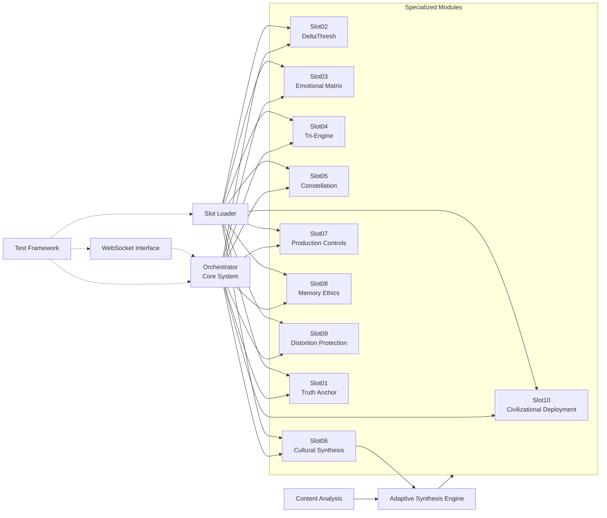

# NOVA Architecture (Light Runtime)

> The **Light Runtime** adds tracing on the EventBus, a central **PerformanceMonitor**, and an **AdaptiveRouter** (with optional circuit breaker) without changing slot contracts.
