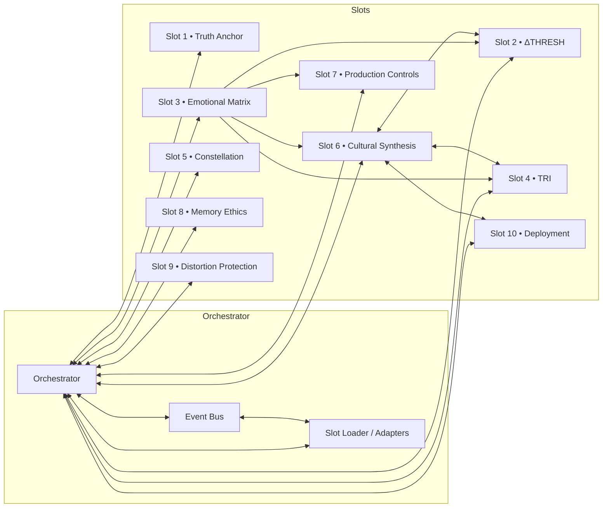

# NOVA Civilizational Architecture

## Overview

The NOVA Civilizational Architecture is a 10-slot AI system designed for advanced AI governance, safety, and deployment at civilizational scale. The system implements a distributed architecture with centralized orchestration, providing specialized capabilities across truth anchoring, threat detection, emotional analysis, production controls, and deployment management.

## System Architecture

### Current System Map



### Evolvable Plugin Model

```mermaid
graph LR
  subgraph Orchestrator
    PL[PluginLoader]
    AR[AdapterRegistry]
  end
  PL-->AR

  subgraph Contracts
    ER[EMOTION_REPORT@1]
    DT[DELTA_THREAT@1]
    TR[TRI_REPORT@1]
    PC[PRODUCTION_CONTROL@1]
    CP[CULTURAL_PROFILE@1]
    NA[NullAdapters]
  end

  AR-->ER
  AR-->DT
  AR-->TR
  AR-->PC
  AR-->CP
  AR-->NA

  subgraph Slots
    S3[Slot 3]
    S2[Slot 2]
    S4[Slot 4]
    S7[Slot 7]
    S6[Slot 6]
  end

  ER-->S6
  DT-->S2
  TR-->S4
  PC-->S7
  CP-->S2
```

    subgraph "Discovery Sources"
        YF[YAML Files<br/>*.meta.yaml]
        EC[Environment<br/>NOVA_SLOTS]
        DR[Dynamic Registry<br/>Runtime]
    end

    PL --> AR
    PL --> MD
    AR --> CR
    
    CR --> ER
    CR --> DT
    CR --> TR
    CR --> PC
    CR --> CP
    CR --> DD

    AR --> NA
    AR --> RA
    AR --> PA

    MD --> YF
    MD --> EC
    MD --> DR

    YF -.->|schema_id<br/>schema_version| ER
    YF -.->|produces<br/>consumes| CP
```

## Slot Summary

| Slot | Name | Purpose | Key Modules | Health Endpoint | Maturity |
|------|------|---------|-------------|-----------------|----------|
| 1 | Truth Anchor | Reality verification and truth assessment | `enhanced_truth_anchor_engine.py`, `orchestrator_adapter.py` | `health.py` | 4/4 Processual |
| 2 | ΔTHRESH | Delta threshold detection and pattern analysis | Core processing engine with delta computation | Via orchestrator | 4/4 Processual |
| 3 | Emotional Matrix | Emotional analysis with escalation management | `emotional_matrix_engine.py`, `escalation.py`, `advanced_policy.py`, `enhanced_engine.py` | `health/__init__.py` | 4/4 Processual |
| 4 | TRI Engine | Three-factor risk assessment | Minimal implementation | Via orchestrator | 3/4 Structural |
| 5 | Constellation | Pattern constellation mapping | Complex multi-engine system | Via orchestrator | 2/4 Relational |
| 6 | Cultural Synthesis | Multicultural truth synthesis | `multicultural_truth_synthesis.py`, `engine.py`, `adapter.py` | `health/__init__.py` | 4/4 Processual |
| 7 | Production Controls | Circuit breaker and production safety | Core control mechanisms | Via orchestrator | 2/4 Relational |
| 8 | Memory Ethics | Memory management and ethical constraints | Ethical memory handling | Via orchestrator | 3/4 Structural |
| 9 | Distortion Protection | Reality distortion detection and mitigation | Detection and response systems | Via orchestrator | 4/4 Processual |
| 10 | Civilizational Deployment | Large-scale deployment coordination | Deployment orchestration | Via orchestrator | 3/4 Structural |

> **Note:** Slots without dedicated health modules export via the orchestrator aggregate.

## Inter-Slot Contracts

| Producer | Consumer | Contract | Payload Keys | Failure Mode | Fallback |
|----------|----------|----------|--------------|-------------|----------|
| Slot 3 | Slot 2 | DELTA_THREAT@1 | `threat_level`, `escalation_path`, `confidence` | NullAdapter | Default safe values |
| Slot 3 | Slot 4 | TRI_REPORT@1 | `risk_factors`, `emotional_state`, `assessment` | NullAdapter | Neutral assessment |
| Slot 3 | Slot 6 | EMOTION_REPORT@1 | `emotional_tone`, `cultural_impact`, `synthesis_weight` | NullAdapter | Cultural neutrality |
| Slot 3 | Slot 7 | PRODUCTION_CONTROL@1 | `control_action`, `severity`, `timeout` | Circuit breaker | Safe production halt |
| Slot 6 | Slot 2 | CULTURAL_PROFILE@1 | `cultural_weights`, `synthesis_result`, `confidence` | NullAdapter | Default cultural model |
| Slot 6 | Slot 4 | CULTURAL_PROFILE@1 | `risk_cultural_factors`, `synthesis_confidence` | NullAdapter | Risk-neutral defaults |
| Slot 6 | Slot 10 | CULTURAL_PROFILE@1 | `deployment_cultural_constraints`, `rollout_strategy` | NullAdapter | Conservative deployment |
| Slot 2 | Slot 7 | DELTA_THREAT@1 | `delta_magnitude`, `threshold_breach`, `action_required` | Circuit breaker | Production freeze |
| Slot 9 | Slot 7 | DISTORTION_DETECTION@1 | `distortion_level`, `protection_action`, `urgency` | Circuit breaker | Immediate protection |
| Slot 8 | Slot 7 | MEMORY_ETHICS@1 | `memory_constraint`, `ethical_boundary`, `enforcement_level` | Circuit breaker | Strict ethical mode |

## Feature Flags

| Name | Default | Effect | Risk Level |
|------|---------|--------|------------|
| `SLOT3_ESCALATION_ENABLED` | `true` | Enables Slot 3 escalation manager | Medium |
| `SLOT3_RATE_PER_MIN` | `600` | Rate limiting for Slot 3 processing | Low |
| `SLOT3_SWING_WINDOW` | `30` | Time window for swing detection (seconds) | Low |
| `SLOT3_SWING_DELTA` | `1.2` | Delta threshold for swing detection | Medium |
| `SLOT3_PREVIEW_MAXLEN` | `160` | Maximum preview length for safety | Low |
| `IDS_ENABLED` | `true` | Enables intrusion detection system | High |
| `IDS_SANDBOX_ONLY` | `true` | Restricts IDS to sandbox environment | High |
| `IDS_SCHEMA_VALIDATE` | `false` | Enables strict IDS schema validation | Medium |
| `PRODUCTION_CONTROLS_ENABLED` | `true` | Enables production control systems | Critical |
| `CIRCUIT_BREAKER_ENABLED` | `true` | Enables circuit breaker protection | Critical |
| `CIRCUIT_BREAKER_FAILURE_THRESHOLD` | `5` | Failure count before circuit trips | High |
| `CIRCUIT_BREAKER_ERROR_THRESHOLD` | `0.5` | Error rate threshold for circuit trip | High |
| `RATE_LIMIT_ENABLED` | `true` | Enables system-wide rate limiting | Medium |
| `RATE_LIMIT_REQUESTS_PER_MINUTE` | `100` | Request rate limit threshold | Medium |
| `RESOURCE_PROTECTION_ENABLED` | `true` | Enables resource usage protection | High |
| `MAX_PAYLOAD_SIZE_MB` | `10` | Maximum payload size limit | Medium |
| `MAX_PROCESSING_TIME_SECONDS` | `30` | Processing timeout limit | Medium |
| `HEALTH_CHECK_ENABLED` | `true` | Enables health monitoring | Low |
| `FAILOVER_ENABLED` | `true` | Enables automatic failover | High |
| `GRACEFUL_DEGRADATION_ENABLED` | `true` | Enables graceful service degradation | Medium |

## Operational Health

### Health Endpoints

- **`/health`**: Aggregated system health including slot self-checks, router thresholds, circuit breaker status, timestamp
- **`/health/config`**: Configuration health including hot-reload status, slot metadata, plugin system status, Slot 6 metrics
- **`/metrics`**: Prometheus-compatible metrics for all slots (latency, error rate, throughput)

### Slot 3 Health Fields (Enhanced)

The Slot 3 Emotional Matrix provides comprehensive health reporting with provenance tracking:

**Provenance & Identity:**
- `schema_id`: Contract schema identifier (`https://github.com/PavlosKolivatzis/nova-civilizational-architecture/schemas/slot3_health_schema.json`)
- `schema_version`: Schema version for compatibility verification (`1`)
- `timestamp`: Health check execution time (Unix timestamp)

**Core Status Fields:**
- `self_check`: Overall system status (`ok`, `error`)
- `engine_status`: Base emotional analysis engine (`operational`, `failed`)
- `basic_analysis`: Analysis functionality (`functional`, `degraded`)
- `escalation_status`: Threat escalation system (`operational`, `degraded`)
- `safety_policy_status`: Advanced safety policy status (`operational`, `degraded`)
- `enhanced_engine_status`: Enhanced engine operational state (`operational`, `degraded`)

**System Assessment:**
- `overall_status`: Composite system status (`fully_operational`, `partially_operational`, `critical_failure`)
- `maturity_level`: Current operational maturity (`0/4_missing` to `4/4_processual`)
- `engine_version`: Emotional matrix engine version

**Diagnostic Data:**
- `sample_analysis`: Real-time analysis sample with `{tone, score, confidence}`
- `escalation_test`: Escalation system validation (`passed`)
- `safety_test`: Safety policy validation (`passed`)
- `performance_metrics`: Enhanced engine performance data

### Slot 6 Health Fields

The Slot 6 Cultural Synthesis provides:

**Provenance & Identity:**
- `schema_id`: Contract schema identifier for Slot 6 cultural profile
- `schema_version`: Schema version (`1`)
- `timestamp`: Health check timestamp

**Core Status:**
- `self_check`: Health status (`ok`, `error`)
- `engine_status`: Cultural synthesis engine status (`operational`, `failed`)
- `version`: System version (`v7.4.1`)

**Operational Metrics:**
- `legacy_calls_total`: Count of legacy system usage
- `basic_synthesis`: Cultural synthesis functionality status

## Configuration Management

The system uses the Enhanced Configuration Manager with the following capabilities:

### Hot-Reload Support
- **Watchdog mode**: File system event-based reload (preferred)
- **Polling mode**: Periodic file modification check (fallback)
- **Disabled mode**: Serverless environments (auto-detected)

### Metadata Tolerance
- **Unknown field tolerance**: Stores unrecognized fields in `extra` dict
- **Legacy field mapping**: 
  - `produces` → `outputs`
  - `consumes` → `inputs` 
  - `slot_id` → `id`
- **Schema evolution**: Backward/forward compatibility support
- **Robust error handling**: Fallback defaults with validation

### Configuration Hierarchy
1. **Slot metadata files**: `*.meta.yaml` in slot directories
2. **Environment variables**: `NOVA_SLOT##_*` prefixed overrides
3. **SystemConfig overrides**: Framework-specific configurations
4. **Runtime validation**: Schema validation with fallback on failure

### Environment Integration
- **Serverless detection**: Auto-disables hot-reload for Vercel/Lambda/GCF
- **Manual override**: `NOVA_HOT_RELOAD` environment variable
- **Slot selection**: `NOVA_SLOTS` comma-separated slot list

## Contracts and Schemas

### Protected Schemas (CI Enforced)

- **`slot3_health_schema.json`**: JSON Schema Draft-07 for Slot 3 health reports with provenance tracking
- **`slot6_cultural_profile_schema.json`**: JSON Schema Draft-07 for Slot 6 cultural profiles with provenance tracking
- **`distortion_detection_response.schema.json`**: Schema for Slot 9 distortion detection responses
- **`feature.ids.contract.json`**: IDS feature contract specification

### Schema Governance & CI Integration

**Contract Freeze Protection:**
- `.github/workflows/contracts-freeze.yml`: Prevents unauthorized schema changes
- Protected paths: `contracts/slot3_health_schema.json`, `contracts/slot6_cultural_profile_schema.json`
- Requires `CONTRACT:BUMP` or `CONTRACT:EXPLAIN` PR labels for modifications

**Nightly Drift Detection:**
- `.github/workflows/contracts-nightly.yml`: Validates schemas against sample payloads
- Tests both minimal and full sample data
- Runs at 2 AM UTC for comprehensive validation

**Provenance Assertions:**
- `.github/workflows/health-config-matrix.yml`: CI matrix testing across Python versions and serverless modes
- Validates presence of `schema_id` and `schema_version` in `/health` endpoint
- Tests both Slot 3 and Slot 6 provenance fields
- Matrix: Python 3.9/3.11/3.13 × Normal/Serverless modes

### Schema Versioning Policy

- **Breaking changes**: Require `schema_version` field increment + `CONTRACT:BUMP` PR tag
- **Compatible changes**: Require `CONTRACT:EXPLAIN` PR tag with rationale
- **All modifications**: CODEOWNERS review mandatory
- **CI enforcement**: Automated validation prevents regression

## How Data Flows

1. **Request Ingestion**: API endpoints (`/health`, `/metrics`) or direct orchestrator calls
2. **Health Aggregation**: `orchestrator/health.py` collects slot self-checks via `collect_slot_selfchecks()`
3. **Slot Health Functions**: Individual slot health modules (e.g., `src/nova/slots/slot03_emotional_matrix/health/__init__.py`)
4. **Provenance Integration**: Health functions load schema metadata and attach `schema_id`/`schema_version`
5. **Response Composition**: Orchestrator aggregates all health data with timestamps and system metrics
6. **Contract Validation**: CI workflows validate response structure against JSON schemas

## Integration Patterns

### Adapter Registry Pattern
- **Discovery**: YAML metadata + environment configuration
- **Registration**: Dynamic adapter loading with fallback to NullAdapter
- **Contracts**: Typed interfaces with version compatibility
- **Health**: Integrated health checks with adapter status

### Circuit Breaker Pattern
- **Failure Threshold**: Configurable via `CIRCUIT_BREAKER_FAILURE_THRESHOLD` (default: 5)
- **Error Rate**: Monitored via `CIRCUIT_BREAKER_ERROR_THRESHOLD` (default: 0.5)
- **Recovery**: Automatic reset with `CIRCUIT_BREAKER_RESET_TIMEOUT` (default: 60s)
- **Graceful Degradation**: Fallback to NullAdapter implementations

### Event Bus Pattern
- **Performance Monitor**: Tracks latency, error rates, throughput per slot
- **Event Publishing**: Asynchronous event distribution
- **Metrics Collection**: Prometheus-compatible metrics export
- **Circuit Breaker Integration**: Automatic failure detection and isolation

