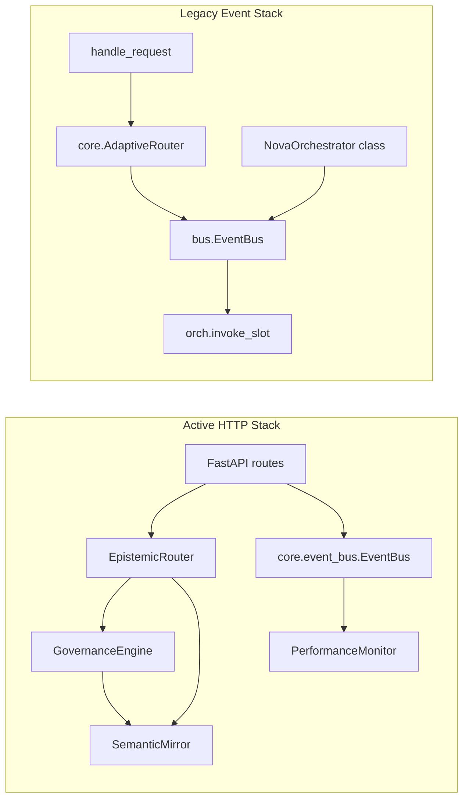
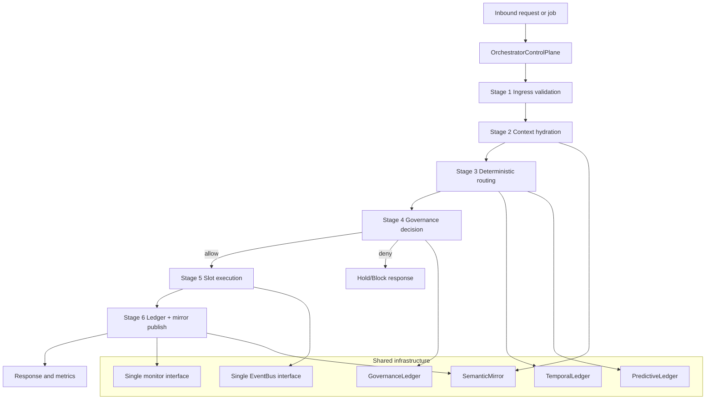
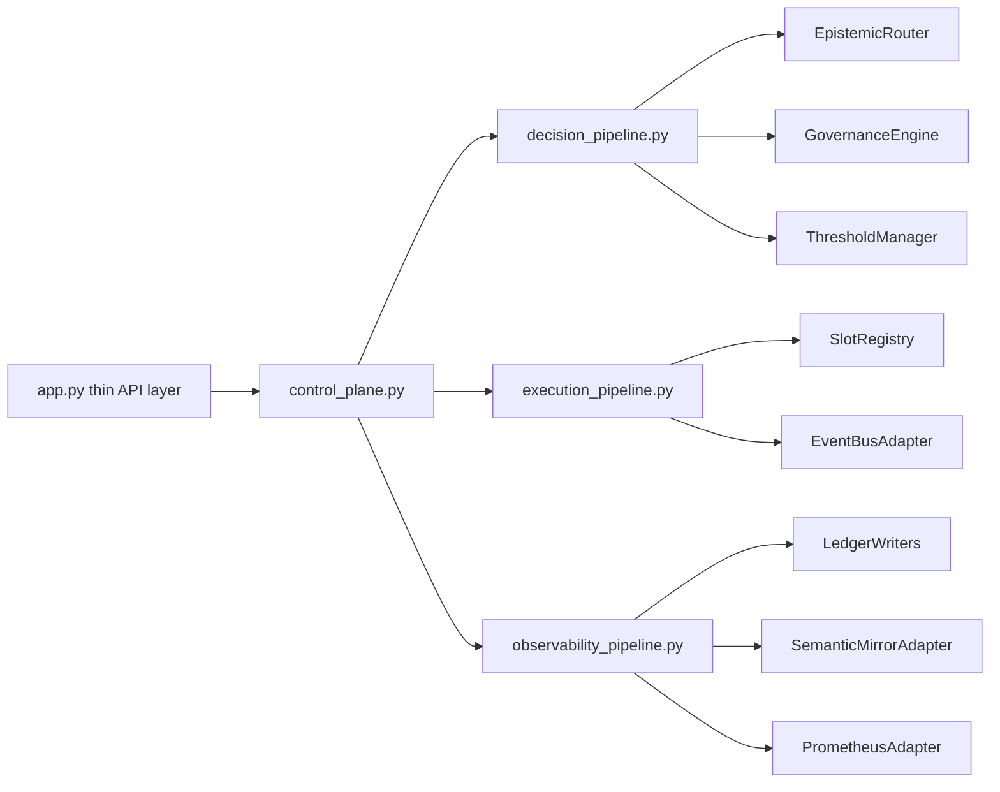
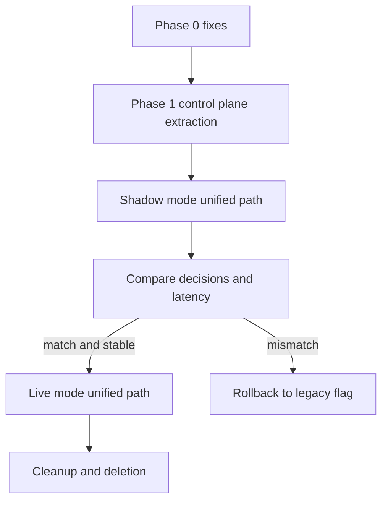

# Orchestrator Architecture Diagrams and Refactor Plan

## Scope

This document describes the current orchestrator runtime in `src/nova/orchestrator` and a practical refactor plan to converge the dual-stack orchestration into a single control plane.

Primary code entrypoint: `src/nova/orchestrator/app.py`.

## Current Runtime (As Implemented)

### Diagram 1: Active HTTP Decision Path

```mermaid
flowchart TD
    A[HTTP Request] --> B[FastAPI app.py]
    B --> C[/router/decide]
    C --> D[Governance precheck record=false]
    D -->|blocked| E[route=hold response]
    D -->|allowed| F[EpistemicRouter.decide]
    F --> G[evaluate_constraints]
    F --> H[TemporalConstraintEngine]
    F --> I[StaticPolicyEngine]
    F --> J[Advisor scores slot05+slot08]
    F --> K[Predictive/URF/MSE/ORP modifiers]
    K --> L[RouterDecision]
    L --> M[Governance final record=true]
    M --> N[HTTP response route+governance]

    F --> O[SemanticMirror publish]
    M --> O
    H --> P[TemporalLedger]
    K --> Q[PredictiveLedger]
    M --> R[GovernanceLedger]
```

### Diagram 2: Current Dual-Stack Topology



## Observed Architecture Risks

1. Dual control paths (`/router/decide` vs `handle_request`) increase drift and testing cost.
2. Two event bus implementations (`core/event_bus.py` and `bus.py`) with different failure semantics.
3. Duplicate `/federation/health` route declarations in `src/nova/orchestrator/app.py`.
4. FastAPI-optional branch sets `app = None` and then route decorators continue below, which is fragile for non-FastAPI environments.
5. `GovernanceEngine` writes `self._state["ris_score"]` without `_state` initialization.

## Target Architecture

### Diagram 3: Unified Control Plane



### Diagram 4: Target Module Boundaries



## Refactor Plan

## Phase 0: Stabilization (short, high-impact)

Goal: remove correctness hazards before structural changes.

Changes:
1. Remove duplicate `/federation/health` declaration and keep one canonical route.
2. Guard post-`app = None` decorators so module remains importable when FastAPI is absent.
3. Initialize governance internal state or remove `self._state` mutation path.
4. Add a runtime self-check endpoint that reports which orchestration mode is active.

Acceptance criteria:
1. `app.py` imports successfully with and without FastAPI installed.
2. Exactly one `/federation/health` route exists in runtime route table.
3. Governance evaluation path executes without attribute errors.

## Phase 1: Control Plane Extraction

Goal: isolate request orchestration into one composable object.

Changes:
1. Add `src/nova/orchestrator/control_plane.py` with `OrchestratorControlPlane`.
2. Move `/router/decide` logic into `control_plane.decide(payload)`.
3. Keep endpoint behavior identical; endpoint becomes thin wrapper.
4. Add explicit decision context object (`request_id`, `source`, `flags`, `trace`).

Acceptance criteria:
1. Endpoint response schema unchanged.
2. New unit tests for `control_plane.decide` cover allow, hold, and safe_mode branches.

## Phase 2: Bus and Execution Unification

Goal: converge on one bus contract and one execution path.

Changes:
1. Create a common `EventBusProtocol` and adapters for both legacy and core bus.
2. Replace `handle_request` direct legacy wiring with control-plane execution stage.
3. Route slot invocation via `SlotRegistry` plus executor abstraction.
4. Deprecate direct use of `bus.py` internals from orchestrator core.

Acceptance criteria:
1. Both HTTP and non-HTTP invocations call the same execution stage.
2. Legacy behavior remains reachable behind a feature flag during transition.

## Phase 3: Decision and Governance Convergence

Goal: make router and governance responsibilities explicit and non-overlapping.

Changes:
1. Define contract: router computes route+score, governance computes allow/deny and rationale.
2. Eliminate duplicated checks where possible or mark intentional duplicate checks as defense-in-depth.
3. Normalize decision metadata keys across router and governance outputs.
4. Add single artifact publisher for mirror + ledgers to avoid scattered write logic.

Acceptance criteria:
1. Deterministic snapshot tests pass for canonical scenarios.
2. `router/debug` and `governance/debug` payloads share consistent naming.

## Phase 4: Observability and Operations Hardening

Goal: reduce operational ambiguity and improve rollback safety.

Changes:
1. Add orchestration mode gauge: `legacy`, `unified_shadow`, `unified_live`.
2. Emit per-stage latency metrics (ingress, routing, governance, execution, publish).
3. Add structured "decision trail id" across logs, mirror, and ledgers.
4. Provide one rollback switch to revert to legacy execution path.

Acceptance criteria:
1. Dashboards can segment failures by stage.
2. Rollback switch can be toggled without code change.

## Phase 5: Deletion and Cleanup

Goal: remove dead paths after burn-in.

Changes:
1. Remove deprecated entrypoints and adapter shims no longer used.
2. Delete duplicated bus abstractions if superseded.
3. Update docs and runbooks to reference the unified control plane only.

Acceptance criteria:
1. No production endpoint depends on deprecated code.
2. Test suite passes with deprecated modules removed.

## Migration Strategy

### Diagram 5: Safe Rollout Sequence



Rollout gates:
1. Shadow mismatch rate below agreed threshold.
2. No increase in hold/safe_mode false positives.
3. P95 latency regression within agreed bound.

## Test Plan by Phase

1. Unit tests:
   - control plane branch tests
   - router/governance contract tests
   - mirror/ledger publisher tests
2. Integration tests:
   - `/router/decide` parity before/after refactor
   - `/router/debug` and `/governance/debug` consistency
3. Failure tests:
   - mirror unavailable
   - predictive snapshot unavailable
   - governance block and forced safe-mode paths

## Execution Backlog (Concrete)

1. `src/nova/orchestrator/app.py`
   - remove duplicate route
   - move decision logic to control plane
   - fix FastAPI-optional guard
2. `src/nova/orchestrator/control_plane.py` (new)
   - define orchestration stages
   - expose `decide` and `execute`
3. `src/nova/orchestrator/core/event_bus.py` and `src/nova/orchestrator/bus.py`
   - add shared protocol adapter
4. `src/nova/orchestrator/governance/engine.py`
   - resolve `_state` mutation path
   - normalize metadata contracts
5. `tests/orchestrator/*` (new/updated)
   - parity tests
   - shadow-vs-live comparison tests

## Decision Record Recommendation

Create an ADR for "Orchestrator Control Plane Unification" before Phase 1 implementation. Include:
1. Chosen bus contract and error semantics.
2. Router vs governance separation boundary.
3. Rollout flags and rollback criteria.

