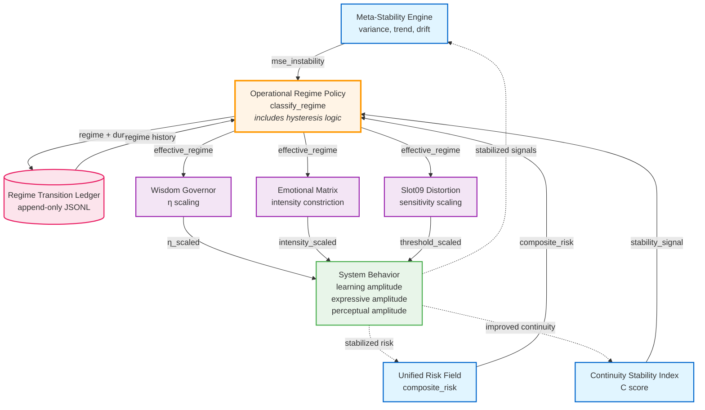
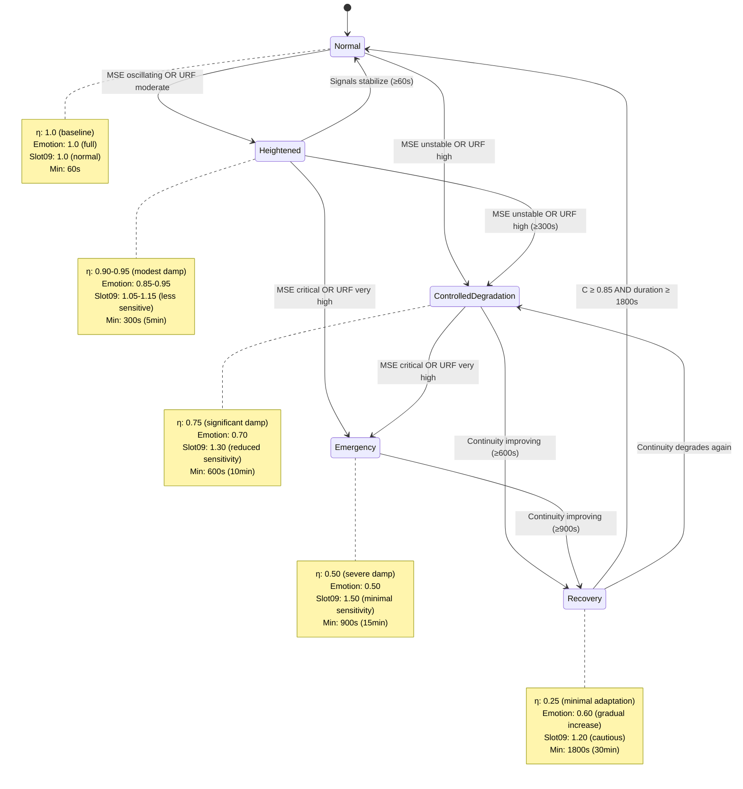
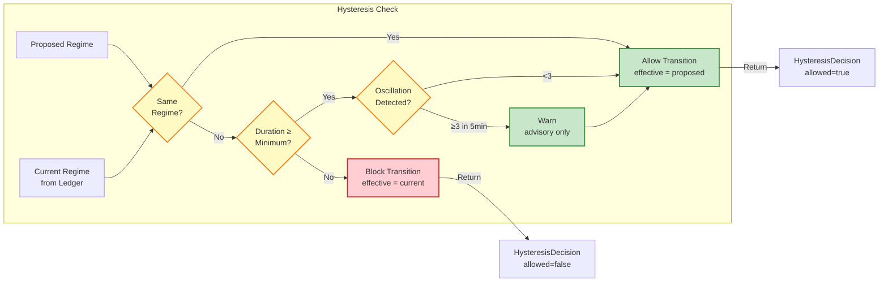
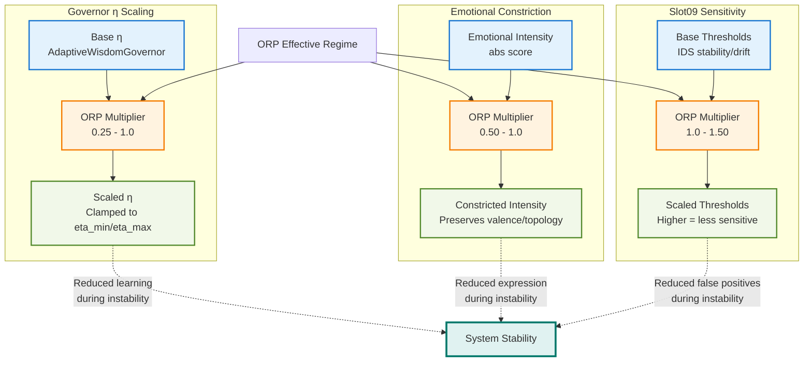

# Phase 11 - ORP Stability Loop

## Overview

The Operational Regime Policy (ORP) completes Nova's continuity stability loop by converting continuity signals into operational regimes and enforcing amplitude modulation across input, processing, and output layers.

## Stability Loop Diagram



## Regime Classification



## Hysteresis Enforcement



## Amplitude Scaling Detail



## Key Properties

### Temporal Invariants
- **Minimum Durations**: Enforced per regime (60s - 1800s)
- **Oscillation Detection**: ≥3 transitions in 5min window (advisory)
- **Recovery Threshold**: Requires C ≥ 0.85 to exit recovery

### Amplitude Invariants
- **Multiplicative Scaling**: `output = input * multiplier` (not additive)
- **Bounded**: All multipliers in [0.0, 2.0] range
- **Topology Preserving**: What is detected/emitted unchanged, only magnitude affected

### Stability Invariants
- **No Uncontrolled Acceleration**: η damped during instability
- **No Noise Amplification**: Sensitivity reduced during instability
- **No Destructive Oscillation**: Hysteresis enforces minimum durations
- **No Abrupt Reversals**: Recovery ramping with C threshold
- **No Continuity Collapse**: Regime transitions deliberate, not reactive

## Feature Flags

All Phase 11 features are flag-gated (default off):

```bash
NOVA_ENABLE_REGIME_LEDGER=0        # Regime transition recording
NOVA_ENABLE_ETA_SCALING=0          # Governor η scaling
NOVA_ENABLE_EMOTIONAL_CONSTRICTION=0   # Emotion intensity scaling
NOVA_ENABLE_SLOT09_SENSITIVITY=0   # Slot09 threshold scaling
NOVA_ENABLE_ORP_HYSTERESIS=0       # Hysteresis enforcement (future)
```

## Observability

### Prometheus Metrics
- `nova_orp_current_regime` - Current regime (0-4 enum)
- `nova_orp_regime_duration_s` - Time in current regime
- `nova_orp_hysteresis_active` - 1 if blocking transitions
- `nova_orp_hysteresis_time_remaining_s` - Time until minimum duration met
- `nova_orp_oscillation_count` - Transitions in window
- `nova_orp_oscillation_detected` - 1 if oscillating
- `nova_orp_transitions_blocked_total` - Counter
- `nova_orp_transitions_allowed_total` - Counter

### Ledger
- Location: `src/nova/continuity/regime_transitions.jsonl`
- Format: Append-only JSONL (one regime entry per line)
- Schema: `contracts/regime@1.yaml`

## Test Coverage

- **Unit Tests**: 121 tests across 4 adapter modules
- **Integration Tests**: 49 tests across 3 integration points
- **Total**: 170 tests (100% coverage of ORP functionality)

## Contracts

- `contracts/orp_policy@1.yaml` - Regime classification rules
- `contracts/orp_stabilization@1.yaml` - Hysteresis enforcement
- `contracts/regime@1.yaml` - Regime data structure
- `contracts/hysteresis_decision@1.yaml` - Hysteresis decision structure
- `contracts/regime_transition_ledger@1.yaml` - Ledger schema

## References

- **Implementation**: `src/nova/continuity/{orp_policy,eta_scaling,emotional_posture,slot09_sensitivity,orp_hysteresis}.py`
- **Integration**: `src/nova/governor/adaptive_wisdom.py`, `src/nova/slots/slot03_emotional_matrix/emotional_matrix_engine.py`, `src/nova/slots/slot09_distortion_protection/hybrid_api.py`
- **Ontology**: `specs/nova_framework_ontology.v1.yaml` v1.5.0 (Phase 11 entry)
