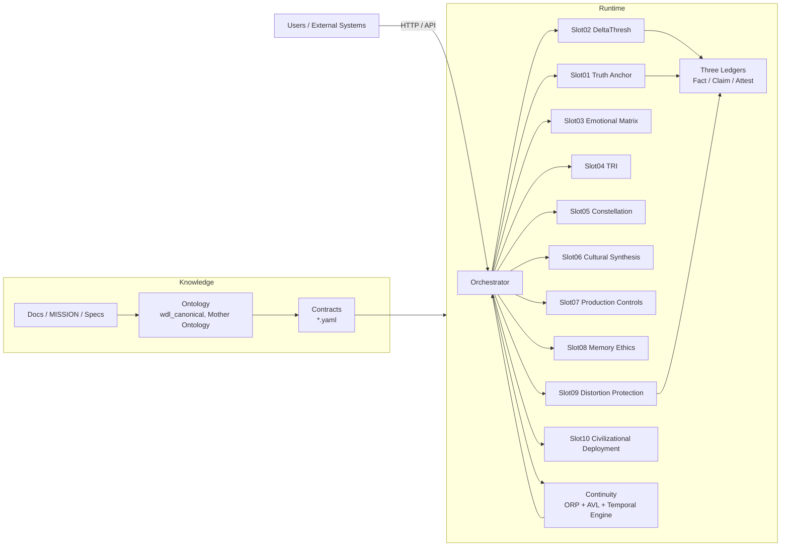

# Nova System Context – Runtime, Cognition, and Ontology

**Purpose:** Provide high-level visual anchors for how Nova is structured as a machine, how cognition flows (including temporal USM), and how documentation/ontology/contracts relate to runtime behavior.

All diagrams are documentation-only and reflect the current Phase 14.5 state (temporal USM installed, governance unchanged).

---

## 1. System Context – “Nova as a Machine”

Big boxes and how they talk: users → orchestrator → slots → ledgers/continuity, with docs/ontology/contracts feeding the whole system.



---

## 2. Cognitive Layer – Slots + Temporal USM + VOID (Phase 14.5)

How cognition flows now: structural USM + VOID + temporal USM into governance, with Slot07 still operating instantaneously (14.4 behavior).

```mermaid
flowchart LR
    subgraph Input
        IN[Text / Events]
    end

    subgraph Slot02_USM["Slot02 – USM + Temporal"]
        G[SystemGraph\n(TextGraphParser)]
        BIAS[BIAS_REPORT@1\n(bias_vector, C_inst, graph_state)]
        TEMP[TemporalUsmState(H_t, rho_t, C_t)]
    end

    IN --> G --> BIAS
    BIAS --> TEMP
    TEMP -->|temporal_usm@1 (optional, flags on)| S7
    BIAS -->|instantaneous| S7

    subgraph Slot07["Slot07 – Cognitive Loop"]
        LOOP[CognitiveLoopController\n(instantaneous only, 14.4)]
    end

    subgraph Slot01
        ORACLE[Quality Oracle\n(uses bias + VOID)]
    end

    subgraph Slot09
        DIST[Distortion Protection\nVOID bypass logic]
    end

    BIAS --> ORACLE
    BIAS --> DIST

    ORACLE --> LOOP
    LOOP --> ORACLE

    %% Temporal governance is design-only as of 14.5
    TEMP -. design only, 14.6 .-> LOOP
```

This diagram captures:

- Slot02 as the structural + temporal analyzer.  
- Slot07 as the governance loop (still using instantaneous USM only).  
- Slot01 and Slot09 as critical consumers of bias + VOID.  
- Temporal USM present but not yet governing (dashed edge).

---

## 3. Ontology → Contract → Runtime Loop – “Rule of Sunlight”

The structural “Observe → Canonize → Attest → Publish” cycle.

```mermaid
flowchart TB
    OBS[Observations\n(files, incidents, metrics)] --> DOCS[Docs / ENTRY / MISSION]
    DOCS --> ONT[Ontology\nwdl_canonical, Mother Ontology]
    ONT --> CONTRACTS[Contracts\nslot*.yaml,\norp@1, temporal_usm@1, ...]
    CONTRACTS --> IMPL[Implementation\nsrc/nova/*, orchestrator/*]
    IMPL --> TESTS[Tests\npytest suite]
    TESTS --> RUNTIME[Runtime Behavior\nSlots, Orchestrator]
    RUNTIME --> METRICS[Metrics / Logs / Attestations]
    METRICS --> OBS
```

This shows how:

- Observed behavior and incidents lead to documentation and ontology updates.  
- Ontology drives contracts, which constrain implementation.  
- Implementation is verified by tests before affecting runtime.  
- Runtime produces new observations and attestations, closing the loop.  

These diagrams are intended as cognitive anchors for operators and agents, not as new behavior. They reflect the current implementation up through Phase 14.5, with Phase 14.6 temporal governance still in the design-only state.
