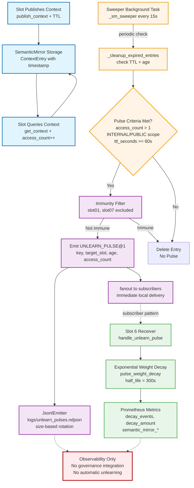

# Unlearn Pulse Flow

## Overview

The Unlearn Pulse system provides observable signals when context expires in the Semantic Mirror, enabling slots to decay weights or refresh synthesis based on temporal relevance. The system uses contract-based emission with exponential decay modeling.

**Status:** Implemented, flag-gated, observability-only (does not drive governance or automatic model unlearning)

## Unlearn Pulse Flow Diagram

What Unlearn Pulse Does (Implemented)

Context Expiry Detection

- Sweeper task: Runs every 15s (NOVA_SMEEP_INTERVAL)
- Expiry check: (current_time - timestamp) > ttl_seconds
- Cleanup: Removes expired entries from SemanticMirror

Pulse Emission Criteria

A pulse is emitted when all conditions are met:
1. Used: access_count > 1 (context was actually queried)
2. Shared: scope is INTERNAL or PUBLIC (not PRIVATE)
3. Meaningful: ttl_seconds >= 60 (not transient/ephemeral)
4. Not immune: Target slot is not in immunity list (slot01, slot07)

UNLEARN_PULSE@1 Contract

Schema fields:
- key - Context key (e.g., "slot03.phase_lock")
- target_slot - Slot to notify (extracted from key prefix or published_by)
- published_by - Original publisher slot
- ttl_seconds - Original TTL
- access_count - Number of times context was queried
- age_seconds - Time since context creation
- scope - INTERNAL, PUBLIC, or PRIVATE
- reason - Always "ttl_expired" (fixed value)
- ts - Pulse emission timestamp

Dual Delivery

1. JsonlEmitter: Appends contract as newline-delimited JSON to logs/unlearn_pulses.ndjson
  - Size-based rotation: NOVA_UNLEARN_LOG_MAX_BYTES (default: 10MB)
  - Keeps N backups: NOVA_UNLEARN_LOG_BACKUPS (default: 5)
2. Fanout: Immediately delivers to local subscribers via fanout(contract)

Slot 6 Weight Decay

- Receiver: handle_unlearn_pulse (registered at startup)
- Decay formula: pulse_weight_decay(base_weight, age_seconds, half_life)
- Base half-life: 300s (5 minutes)
- Anomaly multiplier: Applied from get_anomaly_multiplier(slot="slot06")
- Backpressure coordination: Reduces half-life by up to 20% under Slot 7 reflex pressure
- Metrics: Tracks decay_events, decay_amount, _last_backpressure

Observability

- Prometheus metrics:
  - semantic_mirror_entries_expired - Total expired entries
  - semantic_mirror_unlearn_pulses_sent - Total pulses emitted
  - semantic_mirror_unlearn_pulse_to_{slot} - Per-slot pulse counters
  - semantic_mirror_canary_seeded - Canary context injections (testing)
  - semantic_mirror_canary_errors - Canary emission failures
- Logging: Pulse details logged at INFO level (gated by NOVA_UNLEARN_PULSE_LOG)

What Unlearn Pulse Does NOT Do

- No governance integration: Pulses do not drive routing decisions or regime transitions
- No automatic model unlearning: No direct weight updates to neural models
- No enforcement: Slots can ignore pulses (subscriber pattern is voluntary)
- No retroactive correction: Only observes expiry, does not rewrite history
- No cross-node propagation: Pulses are local to the orchestrator process (federation does not relay pulses)

Immunity List

Slots that never receive unlearn pulses:
- slot01 (Truth Anchor) - Foundational oracle, should not decay
- slot07 (Production Controls) - Safety-critical, must remain stable

Rationale: Protect core truth and safety systems from context decay interference.

Feature Flags

All unlearn pulse features are flag-gated:

NOVA_SMEEP_INTERVAL=15                     # Sweeper interval (seconds)
NOVA_UNLEARN_PULSE_LOG=1                   # Enable pulse logging (1=on, 0=off)
NOVA_UNLEARN_LOG_MAX_BYTES=10485760        # Log file size before rotation (bytes)
NOVA_UNLEARN_LOG_BACKUPS=5                 # Number of rotated backups to keep
NOVA_UNLEARN_PULSE_PATH=logs/unlearn_pulses.ndjson  # Log file path
NOVA_UNLEARN_ANOMALY=0                     # Enable anomaly multiplier integration (default: off)

Canary System (Testing)

Optional canary context injection for pipeline verification:

NOVA_UNLEARN_CANARY=0                      # Enable canary (1=on, 0=off)
NOVA_UNLEARN_CANARY_PERIOD=3600            # Canary seed interval (seconds, default: 1h)
NOVA_UNLEARN_CANARY_KEY=slot06.cultural_profile  # Context key to inject
NOVA_UNLEARN_CANARY_PUBLISHER=slot05       # Simulated publisher slot
NOVA_UNLEARN_CANARY_TTL=60                 # Canary TTL (must be >= 60s to be pulse-eligible)
NOVA_UNLEARN_CANARY_AGE=120                # Age since expiry when injected (seconds)

Purpose: Verify that expired contexts with sufficient TTL and access count produce pulses end-to-end.

Rollback Strategy

Instant disable without redeploying:
1. Set NOVA_UNLEARN_PULSE_LOG=0 to silence logging
2. In app.py, uncomment set_contract_emitter(NoOpEmitter()) to disable all pulse delivery
3. Restart orchestrator

No code changes required -- deployment switches via environment.

Integration Points

Semantic Mirror

- Implementation: src/nova/orchestrator/semantic_mirror.py
- Sweeper: _sm_sweeper async task started in app.py lifespan
- Cleanup: _cleanup_expired_entries called every 15s

Contract Emitter

- Interface: src/nova/orchestrator/contracts/emitter.py
- JsonlEmitter: app.py startup configures path and rotation
- Fanout: fanout(contract) triggers all registered subscribers

Slot 6 Receiver

- Implementation: src/nova/slots/slot06_cultural_synthesis/receiver.py
- Registration: register_slot06_receiver() called in app.py startup
- Decay: pulse_weight_decay from nova.orchestrator.contracts.decay

Test Coverage

- Unit tests: tests/orchestrator/test_semantic_mirror.py (expiry, pulse criteria)
- Integration tests: tests/integration/test_unlearn_pulse_e2e.py (sweeper -> emission -> fanout)
- Contract tests: tests/contracts/test_unlearn_pulse_schema.py (Pydantic validation)

Contracts

- contracts/unlearn_pulse@1.yaml - UNLEARN_PULSE@1 schema definition
- contracts/decay@1.yaml - Exponential decay formula specification

References

- Implementation: src/nova/orchestrator/semantic_mirror.py
- Contract: src/nova/orchestrator/contracts/unlearn_pulse.py
- Receiver: src/nova/slots/slot06_cultural_synthesis/receiver.py
- Startup: src/nova/orchestrator/app.py (search _sm_sweeper, register_slot06_receiver)
- Metrics: src/nova/orchestrator/prometheus_metrics.py

**Annotation check:**
- OK Matches Assumption 21 ("Semantic Mirror tracks **context expiry** and emits UNLEARN_PULSE signals--but these are logged, not automatically acted upon")
- OK Matches Assumption 22 ("The system assumes **human-in-loop** for critical decisions")
- WARN Shows connection to Slot 6 (acknowledged as voluntary subscriber, not governance-coupled)

**No new claims. No future arrows. No implied autonomy. Unlearn pulse is observability-only.**
